<h1 align = "center">transformer</h1>

## 应用背景

输入输出均为向量序列（sequence）：即seq2seq问题

## seq2seq应用实例

* 语音识别
* 机器翻译
* 语音翻译（为何不分两阶段，先语音识别再翻译：世界众多语言无文字）
* 语音合成
* 聊天机器人
* Q&A（输入：question和context，输出：answer）
* 语法剖析
* 多标签分类（multi-label classification，区别于multi-class classification，multi-class是从中多标签中选择一个作为输出，multi-label是输出目标所从属的多个类别）
* 目标检测

## transformer实现

seq2seq任务的模型通常包含：**Encoder**和**Decoder**，如下图所示：

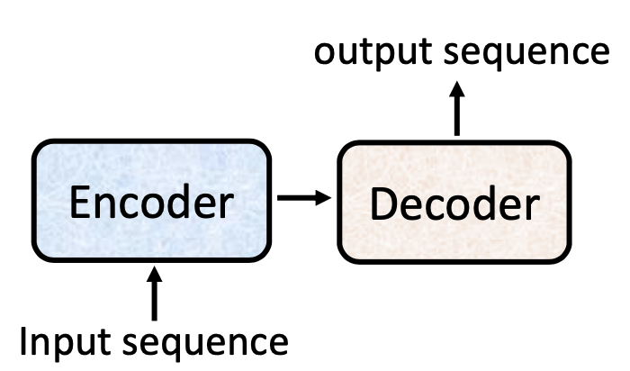

**注意**：此架构并非transformer独有，transformer出现前的seq2seq任务中encoder和decoder使用RNN或CNN代替。

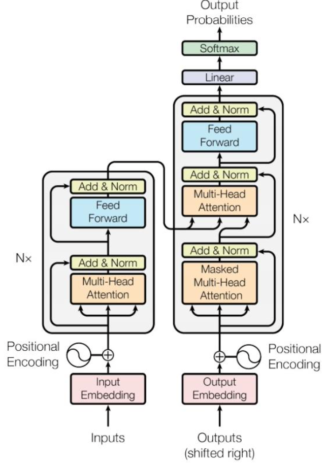

​																																			transformer图示：左半边为Encoder，右半边为Decoder

下文将按照transformer的图示分为encoder、decoder、连接处的cross attention以及transformer的训练进行介绍，

### Encoder

Encoder的输入和输出向量个数相同，使用图示结构对输入embedding进行编码：

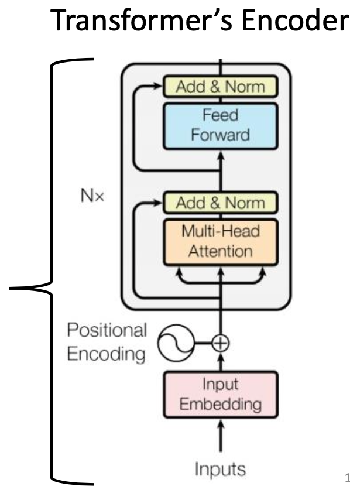

Encoder的结构细节如下：

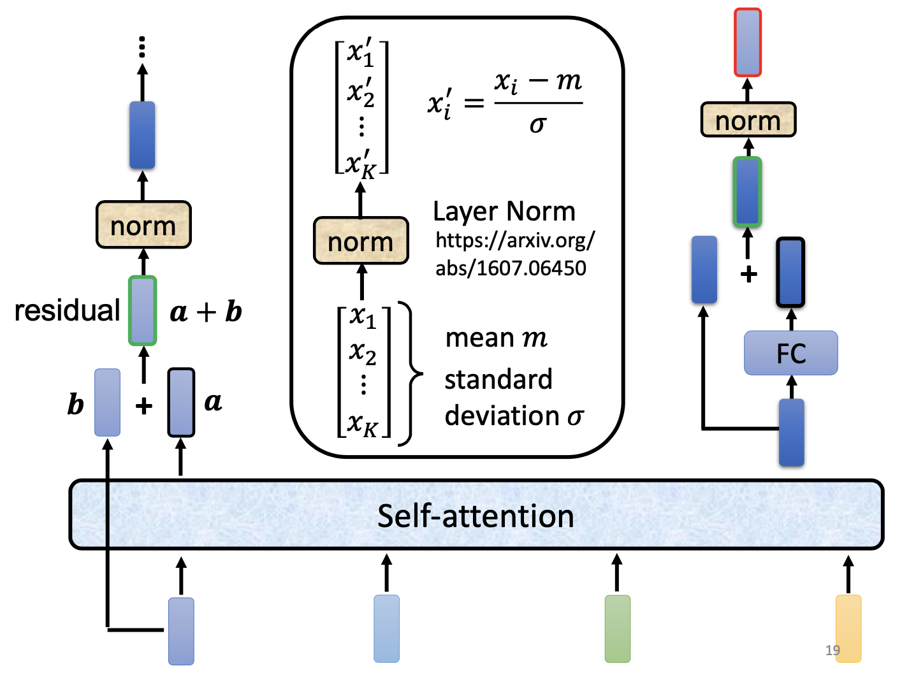

1. 输入embedding与Positional Encoding叠加得到b；
2. 叠加结果b送入multi-head attention后得到a，a与b累加后进行层归一化（layer Norm）；
3. 上述结果送入Feed Forward（FC层）后与上述结果累加后进行层归一化（layer Norm）；
4. 重复步骤2和3N次后的输出即为Encoder编码结果。

**注意**：

* 框中Add操作类似于Residual残差操作，目的在于解决梯度消失的问题和解决权重矩阵的退化问题。
* 注意区分batch-Norm和layer-Norm，BN是对一个batch中，不同样本的相同特征进行归一化，而LN是对一个样本的不同特征进行归一化。

### Decoder

Decoder的输入和输出向量个数不同，使用图示结构对Encoder的输出进行解码：

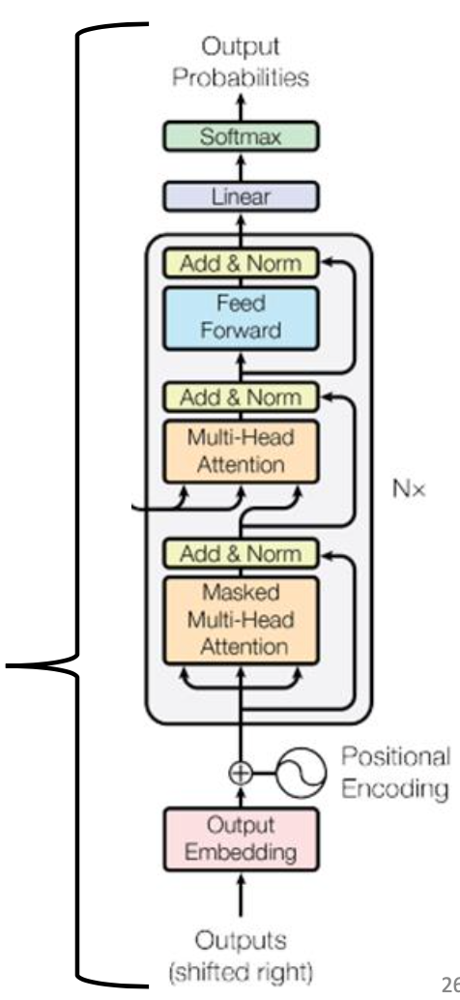

按照Decoder的输入不同，将Decoder分为Autoregressive和Non-autoregressive。

#### Autoregressive（AT）自回归

自回归的输入上一个time step的输出，第一个time step的输入为特定Start向量，最后一个time step的输出为特定End向量。

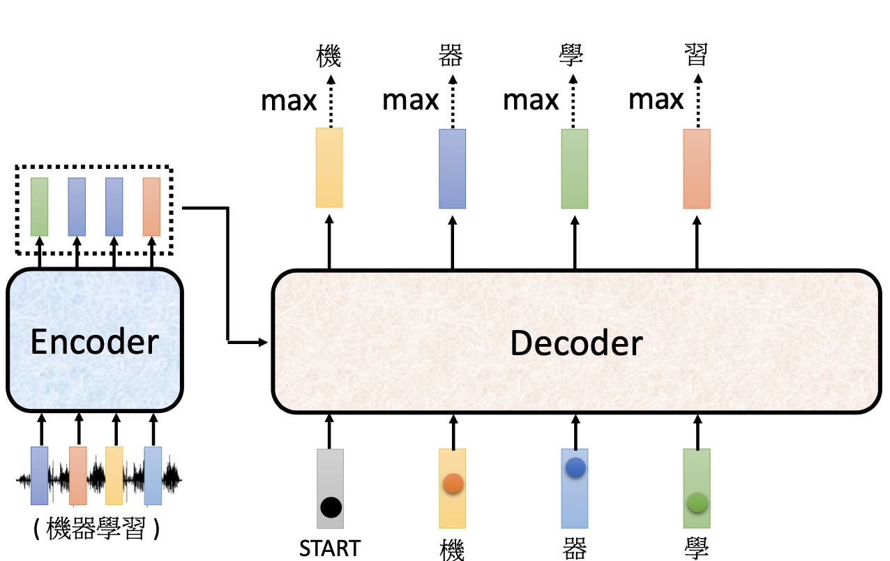

#### Non-autoregressive（NAT）非自回归

NAT的输入为一排Start向量，输出为包含一个End向量的向量序列，只取输出End前的部分作为输出结果。

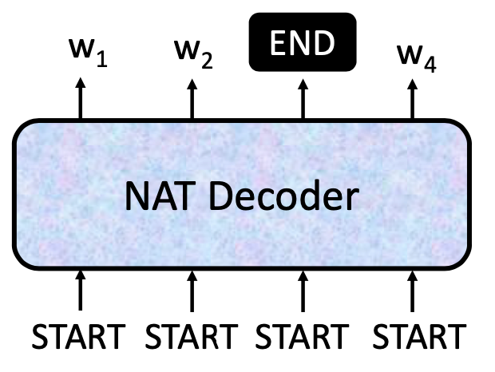

**注意**：输出长度如何决定（1.额外输出一个预测结果代表输出长度，2.输出较长序列，忽略End后的向量）

**优势**：可并行化处理，输出长度可控

**劣势**：NAT的表现通常没有AT的好

Encoder的结构细节如下：

1. 输出embedding与Positional Encoding叠加；
2. 叠加结果送入masked multi-head attention后与叠加结果累加后进行层归一化（layer Norm）；
3. 归一化后作为query，与从Encoder送入的Key和Value一起送入Cross-attention后与上一层归一化结果累加后进行层归一化（layer Norm）；
4. 归一化结果送入Feed Forward（FC层）后与上一层归一化结果累加后进行层归一化（layer Norm）；
5. 重复步骤2到4N次；
6. 输出结果经过FC层和Softmax后输出解码结果。

#### masked multi-head attention

步骤2中的masked multi-head attention区别于multi-head attention，具体如下图：

b1由a1产生；b2由a1、a2产生；b3由a1、a2、a3产生；b4由a1、a2、a3、a4产生。

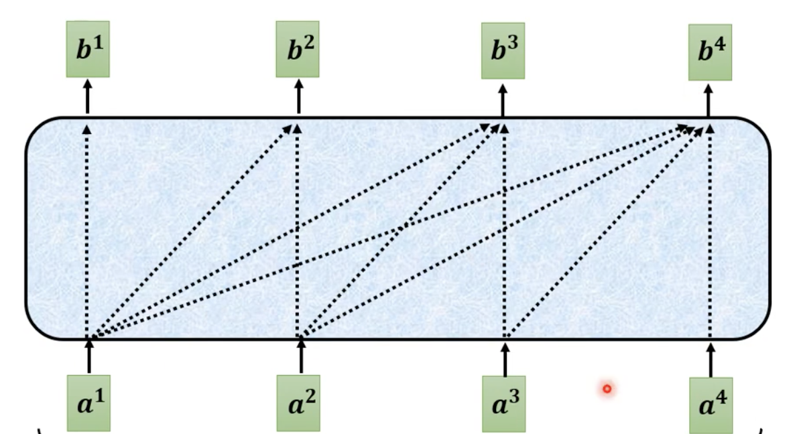

例如，下图解释了b2的产生，只与a1和a2有关，与a3、a4无关。因为，对于Decoder来说，其输入均来自于上一个time step的输出，计算b2的时候，a3和a4均未产生。

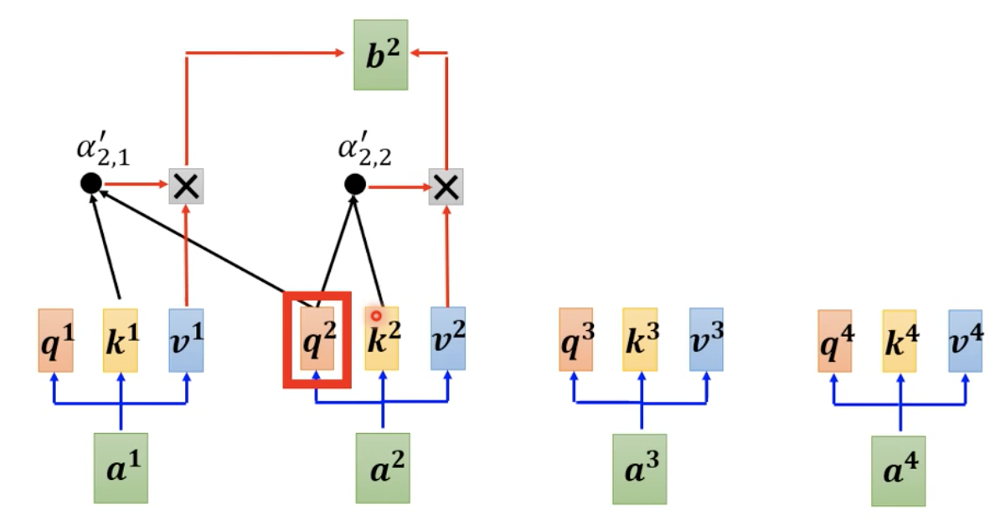

### Cross Attention

目的：使Decoder使用到Encoder中编码的信息。

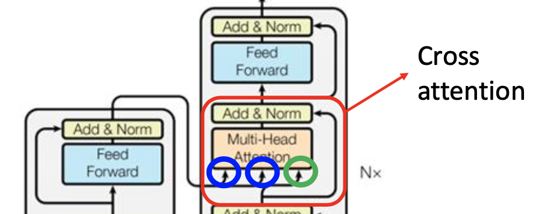

Encoder提供key和value（蓝色），Decoder提供query（绿色）。

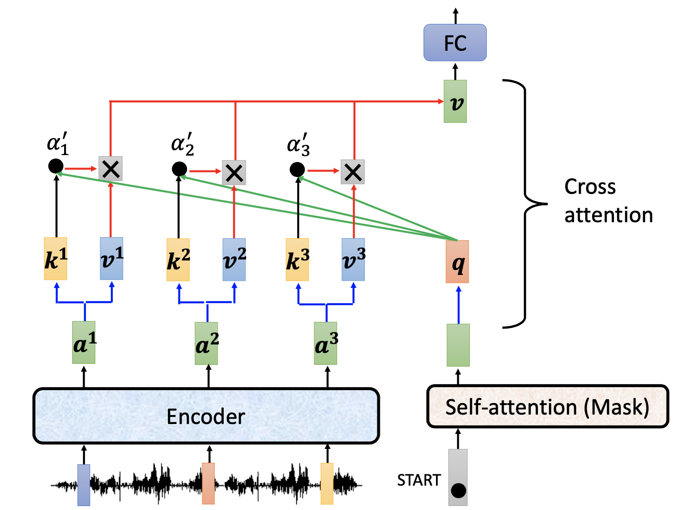

步骤：

1. 开始向量通过masked attention后经过变换矩阵，产生query；
2. Encoder的输出向量分别产生key和value；
3. 来自Decoder的query和来自Encoder的key、value经过cross attention产生输出。

拓展：

原论文中，Decoder的每一个cross attention的key和value均来自于Encoder输出的最后一层。但在实际应用中，不一定如此。

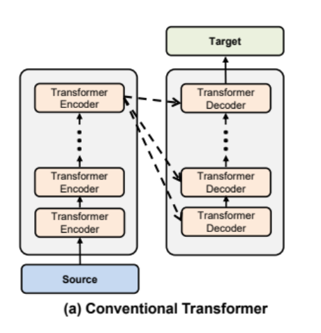

​																																								原论文中cross attention的图示

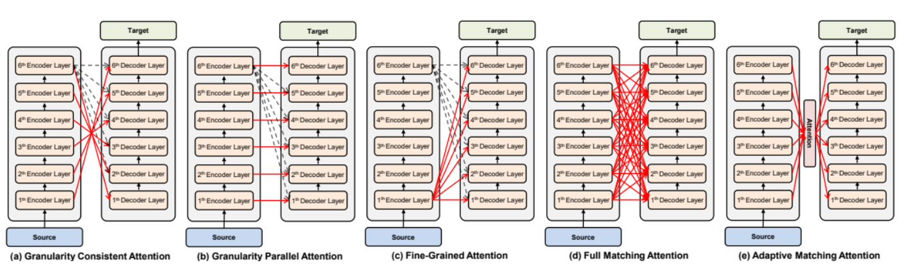

### 训练

#### Teacher forcing

在训练Decoder的过程中，输入使用的是ground truth，损失函数是minimize cross entropy。

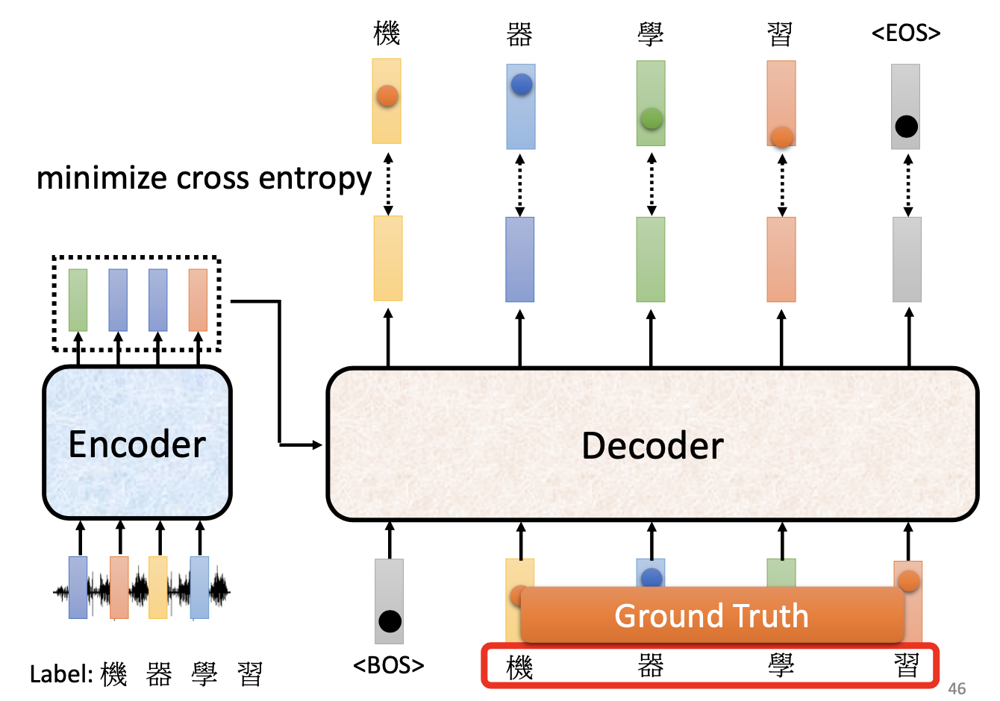

如上图所示：训练的过程中，Decoder的输入不使用上一个time step的输出，而是使用ground truth。（该技术称为**Teacher forcing**）

目的：保证并行计算，避免错误的进一步放大，加快训练速度。

劣势：由于训练和预测的时候decode行为的不一致， 导致预测单词在训练和预测的时候是从不同的分布中推断出来的，产生的这种mismatch的现象称为Exposure Bias。

解决方法：

* scheduled sampling

  因为 Teacher-Forcing 技术在训练前期的确是能够很大的加速模型收敛的， 那么设计出如下方案：

1. 模型在训练过程中的每一个steps，有 ![[公式]](https://www.zhihu.com/equation?tex=p) 的概率选择使用 teachering-forcing，有 ![[公式]](https://www.zhihu.com/equation?tex=1-p) 的概率选择使用 Autoregressive。
2. 模型在训练前期， ![[公式]](https://www.zhihu.com/equation?tex=p) 应该尽可能的大，这样能够加速收敛；而在快要结束训练的时候， ![[公式]](https://www.zhihu.com/equation?tex=1-p) 尽可能的大，让模型在 Autoregressive 的方案中尽可能的修复自身生成的错误。

* 训练时加入错误的东西
* 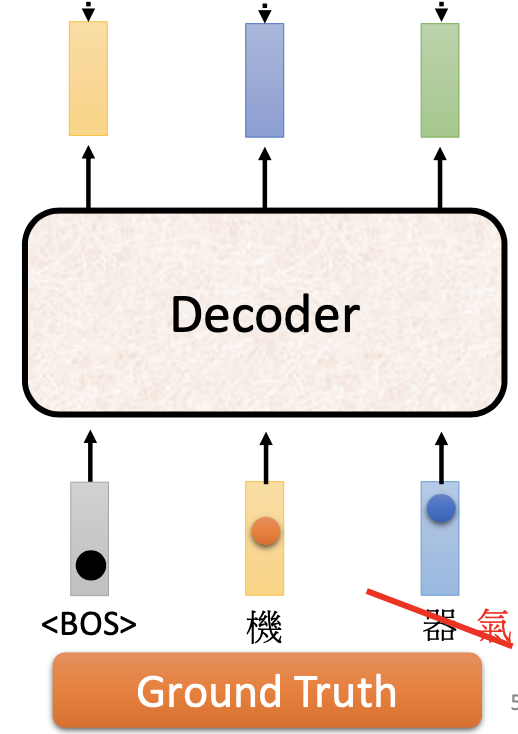

#### 优化评价指标

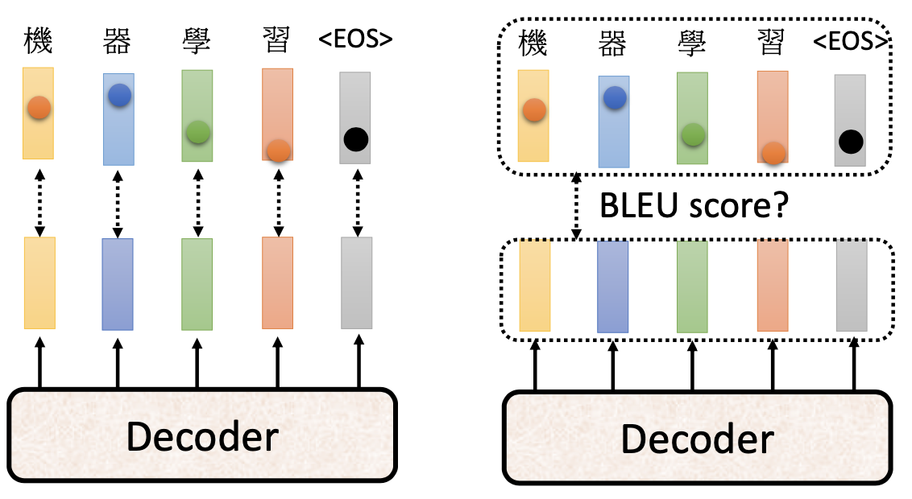

* minimize cross entropy：在训练的过程中，会分别计算单个输出与单个ground truth的CE loss。
* BLEU score：通常在验证和测试的过程中，会将整个输出与ground truth之间做比较。（BLEU不可微，因此难以作为训练时的损失函数）

但最小化minimize cross entropy并不一定会最大化BLEU score。

## 拓展

Guided attention

目的：在一些seq2seq任务中，输入和输出是有固定顺序的，例如在语音辨识和语音合成中。

方法：可以使用Monotomic attention或location-aware attention来要求attention按固定的顺序运行。

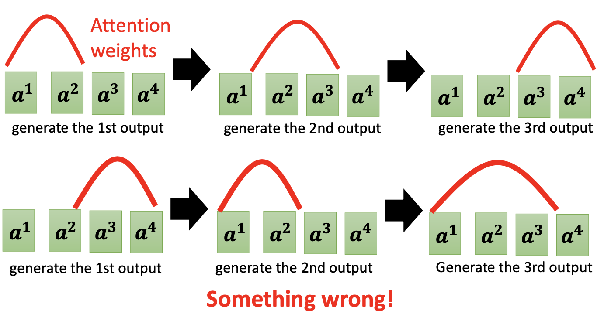

Beam search

目的：对于Decoder中有多个time step时，不一定每次取最高置信度的输出就能取得最佳结果，可能只是达到了局部最优，如下图：

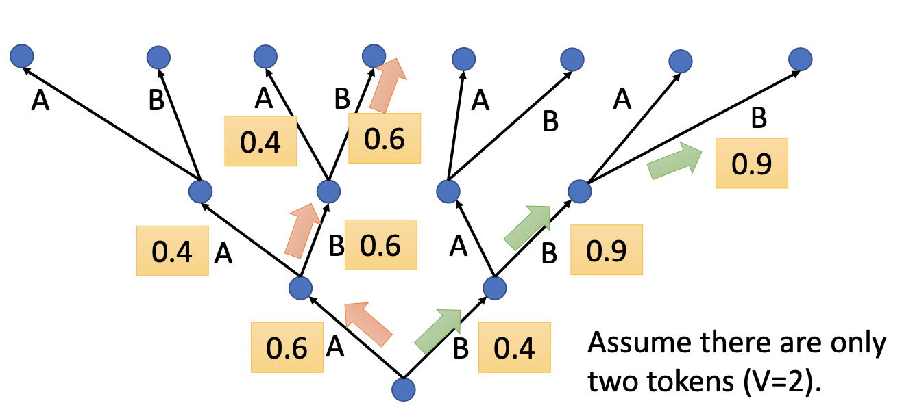

图中，红色路径每次均取置信度最高的结果，是**Greedy Decoding**；然而绿色路径才是最佳的。

方法：使用Beam search可以搜寻出**类全局最优**的结果。

结果：实验结果表明，一般对于有明确唯一的答案时，Beam search有效。但当需要机器具有创新性思维时，或者答案不唯一时，Beam search的效果变差。

